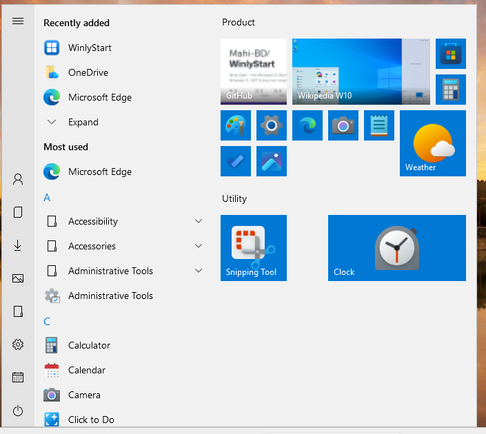
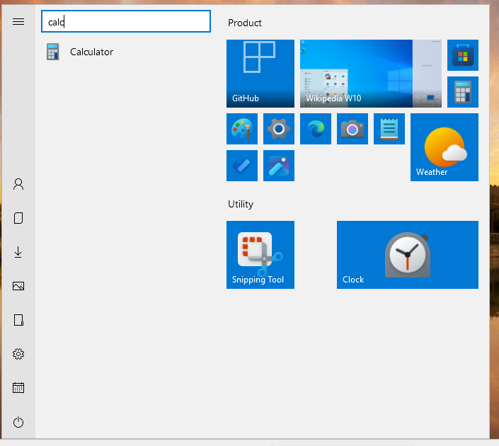
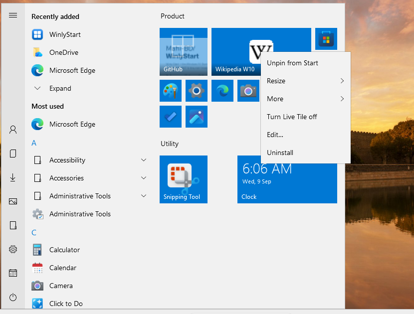
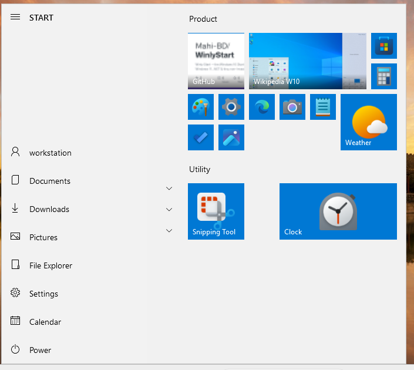
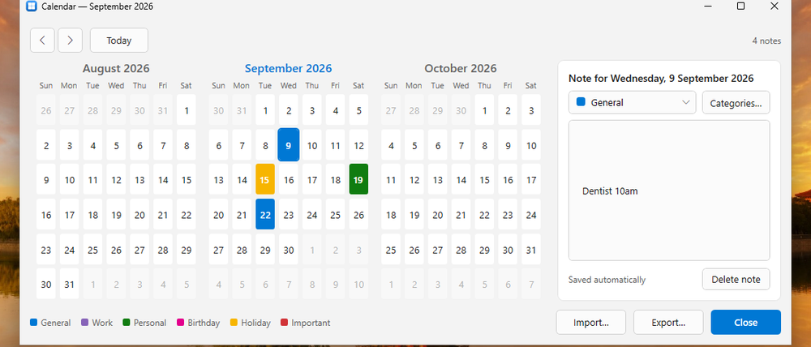
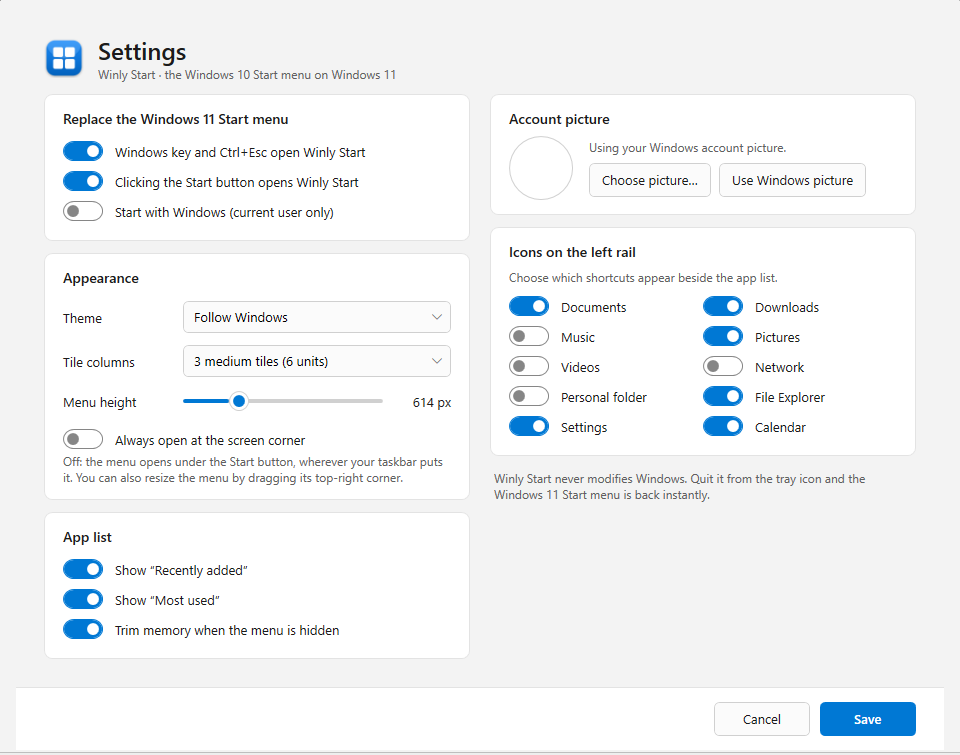

# Winly Start

[](https://github.com/Mahi-BD/WinlyStart/actions/workflows/build.yml)
[](https://github.com/Mahi-BD/WinlyStart/releases/latest)
[](LICENSE)


**[winlystart website](https://mahi-bd.github.io/WinlyStart/)** · **[download](https://github.com/Mahi-BD/WinlyStart/releases/latest)**

**The Windows 10 Start menu, back on Windows 11.**

Winly Start is a small, open-source (MIT) .NET 8 app that brings the Windows 10 Start menu
experience to Windows 11 — the left rail, the A–Z app list with folders and the alphabet
jump grid, live tiles and the tile board — while following your Windows 11 theme (light/dark,
accent colour, transparency) and keeping the Windows 10 *look*.

It **replaces** the Windows 11 Start menu in everyday use: the Start button, the Windows
key and Ctrl+Esc all open Winly Start. It does this without touching Windows itself — quit
the app and Windows 11 is exactly as it was.



## Install

Download from the [latest release](https://github.com/Mahi-BD/WinlyStart/releases/latest):

| Download | What it is |
|---|---|
| **`WinlyStart-Setup-x.y.z.exe`** | **Recommended.** Per-user installer — no administrator rights, nothing needed on the machine. Adds Start-menu and optional desktop shortcuts, and can start Winly Start when you sign in. |
| `WinlyStart-win-x64-selfcontained.zip` | Portable single .exe. Needs nothing installed. |
| `WinlyStart-win-x64.zip` | Portable single .exe, needs the [.NET 8 Desktop Runtime](https://dotnet.microsoft.com/download/dotnet/8.0). |

After installing, a tray icon appears — press the Windows key. Right-click the tray icon for
**Settings…**. To uninstall: Windows Settings → Apps, or tray icon → **Exit** and delete the
folder. Your tiles and settings live in `%LocalAppData%\WinlyStart` and are left in place.

## Features

### The menu
The familiar Windows 10 layout: a left rail, "Recently added" and "Most used", the A–Z list
with expandable Start-menu folders, and a tile board with groups.

Type anywhere to search; press Enter to launch the first match.



### Live tiles
Windows 11 removed the live-tile platform, so Winly Start provides its own faces for the
things it has real data for: a **Calendar** tile showing your next note, a **Clock** tile,
a **Photos** slideshow from your Pictures folder, and **website tiles that show the site's
own preview image**. Each tile has a *Turn Live Tile on/off* switch in its right-click menu.

### Tiles you can arrange
Drag tiles to rearrange them — the others glide out of the way. Resize between Small, Medium,
Wide and Large, drag a tile below the board to start a new group, drag a group header to
reorder groups, and click a group header to name it.



### Add anything to Start
Right-click empty space on the tile board to **add any program, file, shortcut or website**.
Websites use the site's favicon as their icon and its own preview image as a live tile, and
anything you add can be renamed or re-pointed later with **Edit…**.

### The expanded rail
Click the hamburger for the labelled rail. Choose which shortcuts appear — Documents,
Downloads, Music, Pictures, Videos, Network, Personal folder, File Explorer, Settings and a
Calendar — in Settings.



### Calendar
A three-month calendar with a note per day. Days with a note take their **category** colour,
and you can add, rename, recolour and delete categories. Notes import and export as JSON or
iCalendar (`.ics`). The window is resizable and remembers its size.



### Settings



## How it replaces the Start menu — and why that is safe

Winly Start never injects into `explorer.exe`, never patches files, never writes outside
`HKCU`. It uses three ordinary, revertible user-mode mechanisms:

* **Windows key / Ctrl+Esc** — a low-level keyboard hook. When you tap the Windows key,
  Winly Start lets the key through *and* sends a harmless masking key alongside it, so
  Windows sees a "Win + something" chord and does not open its own menu. Every Win+X
  shortcut keeps working natively.
* **Start button** — a low-level mouse hook that recognises a left-click on the taskbar's
  Start button (located through UI Automation, so it works with left- and centre-aligned
  taskbars). The menu opens **where the Start button is**.
* **Fallback** — if the Windows 11 menu still appears (touch gesture, or the Windows key
  pressed while an elevated app has focus, which hooks cannot see), Winly Start notices it
  and takes over; the Windows menu dismisses itself.

Closing Winly Start removes the hooks; Windows 11 is untouched.

## Memory

Winly Start is written to stay small: plain WPF, no UI frameworks, no WinForms, icons loaded
lazily at the exact sizes shown and frozen, a virtualised app list, live-tile timers that run
only while the menu is open, and the working set is trimmed when the menu hides.

## Build from source

```
git clone https://github.com/Mahi-BD/WinlyStart
cd WinlyStart
dotnet build src/WinlyStart -c Release
dotnet publish src/WinlyStart -c Release -r win-x64 --self-contained true -p:PublishSingleFile=true -o out/sc
```

Requires the .NET 8 SDK. The project sets `EnableWindowsTargeting`, so it also *compiles*
on Linux/macOS (handy for CI and reviews); it only *runs* on Windows 10/11. The installer is
built with [Inno Setup](https://jrsoftware.org/isinfo.php) from `installer/WinlyStart.iss`.

Developer notes, architecture and the project rules are in
[`Repo/Instruction/read.md`](Repo/Instruction/read.md).

## Known limitations

* The menu opens on the primary monitor's taskbar; multi-monitor placement is on the roadmap.
* Acrylic renders as a solid tint on current Windows 11 builds — the old blur API no longer
  blurs, and real blur needs the DWM system-backdrop path.
* Website live tiles show the preview image a site publishes (`og:image`), not a live browser
  render — embedding a browser engine would cost a large dependency and a lot of memory.
* Pin to taskbar and jump lists are not available (no public API).
* While an **elevated** window has focus, the Windows key is handled by the fallback path
  (brief flicker of the Windows 11 menu). Winly Start deliberately does not run elevated.

## Privacy

Winly Start collects nothing — no telemetry, no analytics, no accounts. Everything stays in
`%LocalAppData%\WinlyStart`. The only network requests it ever makes are to a website you add as a
tile, to read that site's icon and preview image. See [the privacy policy](https://mahi-bd.github.io/WinlyStart/privacy-policy.html).

## Contributing

Issues and pull requests are welcome — see [CONTRIBUTING.md](CONTRIBUTING.md). The two rules
that matter most: keep the code and the working set small, and never do anything that could
harm the operating system.

## License

[MIT](LICENSE). Windows, Windows 10 and Windows 11 are trademarks of Microsoft Corporation;
Winly Start is an independent project and is not affiliated with Microsoft.
